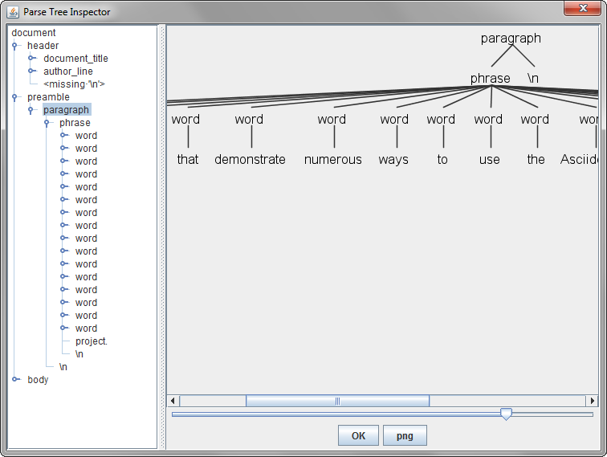

= Asciidoctor Grammar Prototype

This repository contains an ANTLR4 grammar for AsciiDoc.

[NOTE]
====
This is a *work in progress* project in an early stage.

Feel free to change anything you need and send a PR.
====

== Hacking

The project uses Gradle as a build tool with the antlr plugin.

Just clone the repo

 $ git clone https://github.com/asciidoctor/asciidoc-grammar-prototype

Import it in your preferred IDE and check the available tasks

 $ gradlew tasks

=== Gradle tasks
To offer some help the following *Gradle tasks* are included:

* `generateGrammarSource`: (added by antlr) parses the grammar file to generate the Java parsing classes.
* `downloadExamples`: downloads a set of readme.adoc files from GitHub repositories into `src/test/resources` to be used for testing.
* `inspectTree-*`: uses antlr's TestRig tool to parse a *.adoc file and show the resulting parsed tree in a separate window (see image below). A task will be created for each *.adoc file found in the `src/test/resources` folder.

=== Helper classes

The class `org.asciidoctor.parser.antlr.AntlrParser` provides some methods to interact with the antlr's API.

Note that it depends on the generated Java parsing classes, expect some IDE complains about missing classes during parser generation.

=== IDE support

Both Intellij and Eclipse have plugins with features like grammar syntax highlighting. Check http://www.antlr.org/tools.html for more details.

== References

Here is a list of interesting links about the syntax and the state of this project:

* http://asciidoctor.org/docs/user-manual/[Asciidoctor User Manual]
* http://discuss.asciidoctor.org/Asciidoc-syntax-definition-td1920i20.html["Official" Discussion]

== Contributing

We want you!
Yes, _you_.

*Anyone* can contribute to an Asciidoctor project.
If you have a specialty, or just some creativity to share, we need your participation.
We have big aspirations for the project and we need an assortment of skill sets in order to reach them.
Make no mistake, contributing is _not_ just for developers.

Of course, we'll always need help with the code as it's the basis of the project.
But code isn't going to make the project successful alone.
We also need documentation, automation, design, marketing, communication, advocacy and more for it to make an impact.

Here are just a few of the ways you can contribute to the project:

* Reporting bugs (_The easiest way to get started!_)
* Sharing ideas on http://discuss.asciidoctor.org
* Suggesting new feature or improvements in the issue tracker
* Speaking about the technology
* Advocating for the technology
* Assisting with design and/or UX (stylesheets, themes, logos, etc)
* Conducting user studies and collecting feedback
* Automating system administration tasks (releases, changelog, announcements, hosting, etc)
* Writing, editing or maintaining the documentation
* Organizing the content (information architecture & content strategy)
* Using or extending the software in a creative way
* Testing a prerelease, a pull request or master
* Reviewing or providing feedback on pull requests
* Writing code (_No patch is too small!_)
** Fixing typos
** Adding or revising comments or API docs
** Fixing issues
** Writing tests
** Refactoring the code
* Something we haven't suggested...seriously!

The best way to get involved is just to show up and express your interest.
We have a very friendly and encouraging culture.
Harassment or offensive behavior is simply not tolerated.
We are positive, even when being critical.
We also strive to lift others up and help them be successful.
We want your choice to participate in an Asciidoctor project be the start of an exciting and rewarding journey.
So thanks for showing up!
